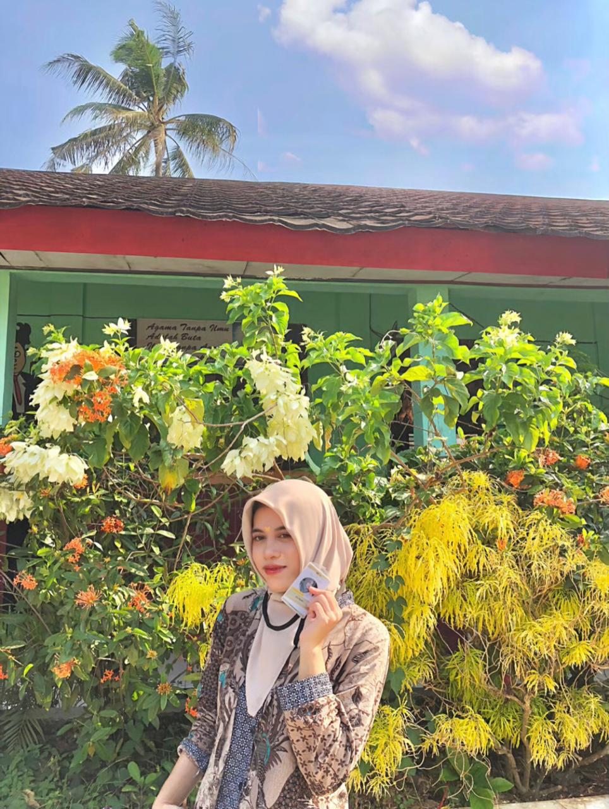

<head>
    <meta charset="UTF-8">
    <meta name="viewport" content="width=device-width, initial-scale=1.0">
    
</head>

<body>
    

        

            

                
            

            

                <h1>Evi Aulia</h1>
                <h2>Tentang saya</h2>
                
Mahasiswa program Studi Informatika

                
Fakultas Teknik Komputer

                
Sekolah Tinggi Teknologi Ilmu Komputer Insan Unggul

                
Jabatan Mahasiswa IT

            

        

        <section>
            

                <h2>Kontak</h2>
            

            

                
auliavi@IT.ac.id
 
                
087832119473

            

        </section>

        <section>
            

                <h2>Pendidikan</h2>
            

            

                
SDN Serang 2011-2017

                
SMPN Cilegon 2017-2020

                
SMAN Cilegon 2020-2023 - Jurusan IPA

                
STTIKOM Insan Unggul 2023-Sekarang - Program Studi Teknik Informatika

            

        </section>

        <section>
            

                <h2>Pengalaman</h2>
            

            

                
Panitia Volunteer Young On Top

            

        </section>

        <section>
            

                <h2>Kemampuan</h2>
            

            

                
Bahasa Inggris

                
Ms. Office (Word, Excel, Access, PowerPoint)

                
Editor

            

        </section>

        <section>
            

                <h2>Penghargaan</h2>
            

            

                
Sertifikat siswa terbaik di sekolah SMP 2019

                
Sertifikat siswa terbaik SMA 2023

                
Mendapat julukan Student Merit Awards 2023

                
Sertifikat Beasiswa Roberto Rocca dari Perusahaan 2023

                
Sertifikat panitia sekaligus peserta volunteer 2024

            

        </section>

        <section>
            

                <h2>Hobi & Minat</h2>
            

            

                
Mendengarkan musik

                
Membaca buku/novel

                
Menulis

            

        </section>

        <section>
            

                <h2>Organisasi</h2>
            

            

                
Aktif dalam organisasi kepramukaan

                
Aktif dalam organisasi KIR (Karya Ilmiah Remaja)

                
Aktif dalam komunitas Youth Ranger Indonesia

                
Aktif dalam komunitas Young On Top

            

        </section>
    

</body>
